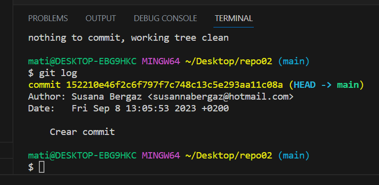

Primero hay que crear un repositorio(repo 02) en remoto(GitHub)

Después lo hemos clonado en nuestro equipo para crear el repositorio de forma local:
        git clone https://github.com/SusannaBH/repo02.git

Una vez clonado y creado de forma local, hemos creado este archido a través de:
        touch readme.md

Seguidamente lo añadimos con "git add ." para después poder realizar un commit:
        git commit -m "Crear commit"

- __RESUMEN__ -
Hemos aprendido que primero tenemos que crear un repositorio(mkdir) que tendremos que iniciar(init) para trabajar con el, después tenemos que añadir(add) los ficheros que creamos(touch) para así poder después realizar un snapshot(commit) y tener los archivos de forma local/remota.